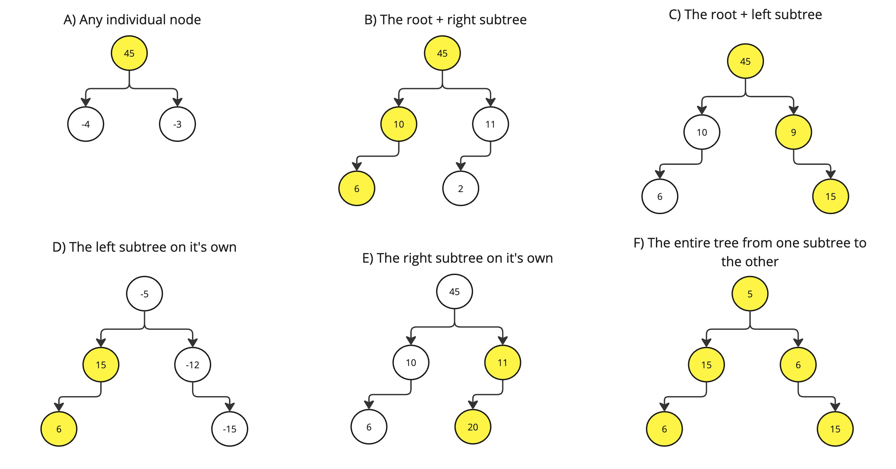

# Binary Tree Maximum Path Sum (124)
[Leetcode Link](https://leetcode.com/problems/binary-tree-maximum-path-sum/)

## Restating Problem
---------------------------------------------------------

Given a binary tree whose nodes are made up of random integers, find the maximum total that can be achieved by summing any number of nodes in the subtree path.

## Solution
------------

#### Intuition

The easiest way for me to think about this problem was to think of every subtree relationship relative to any given node.

Below, I have illustrated what these paths could be:
<center>
    
</center>

In this case, the root node is in reference to the first node. However, keep in mind, any of the example paths in the above diagrams could be leading from a parent.

In order to traverse all the possible paths to the max sum, we will need to ensure that each root is able to evaluate itself and it's potential paths. Furthermore, the root node will need to know the maximum possible paths in it's left and right nodes. This is hinting at **a post-order traversal** of the tree.

Lastly, keep in mind that **the max sum may not involve the root**. However, the root still needs to use a left max and right max to see which is the optimal path.
#### Approach

1. We'll initialize a global variable `max` to keep track of the max sum.
2. We'll create a recursive function to perform our **post-order traversal**
	1. We start by doing a `null` check on the current node, and return `0` if it is
	2. Then we do our post-order traversals to get the maximum sum
	3. Once those are complete, we have the maximum possible path on the `left` and `right`.
	4. There needs to be a comparison of all the potential paths described above and the current `max` value to set what the maximum possible path is at this point in recursion.
	5. Now this is the tricky part, we need to return a `max`. Since we're taking a recursive approach, the return value will be use by a parent to evaluate it's respective possible paths.

	   **As noted above, this is not the same as comparing all possible paths at this current node.**

	   Rather, a parent node can only traverse the right side of it's child, the left side of it's child, or stop at the child. The maximum of these three values is the max possible path of any respective parent node
3. Finally, once we'll call our `traverse()` function on the input tree root. Since the return value of this function may not actually be our maximum, we need to return the `max` variable we defined below.

#### Code

```js

/**
 * Definition for a binary tree node.
 * function TreeNode(val, left, right) {
 *     this.val = (val===undefined ? 0 : val)
 *     this.left = (left===undefined ? null : left)
 *     this.right = (right===undefined ? null : right)
 * }
 */
/**
 * @param {TreeNode} root
 * @return {number}
 */
var maxPathSum = function(root) {
    let max = -Infinity;

    const traverse = (r) => {
        if (!r) return 0;

        const maxLeftSum = traverse(r.left) || 0
        const maxRightSum = traverse(r.right) || 0;

        const compare = [
            // a path that's just the current root on it's own
            r.val,
            // max sum on left subtree
            r.val + maxLeftSum,
            // max sum on right subtree
            r.val + maxRightSum,
            // a path that leads from the bottom of the one subtree and the end of another
            maxLeftSum + maxRightSum + r.val,
            // previous max
            max
        ];

        max = Math.max(...compare)

        return Math.max(r.val + maxLeftSum, r.val + maxRightSum, r.val);
    }

    traverse(root)

    return max
};

```

#### Complexity

Runtime:  O(n)

Memory: O(1)

## Results
----------

Runtime: 3ms
Memory: 63.88MB